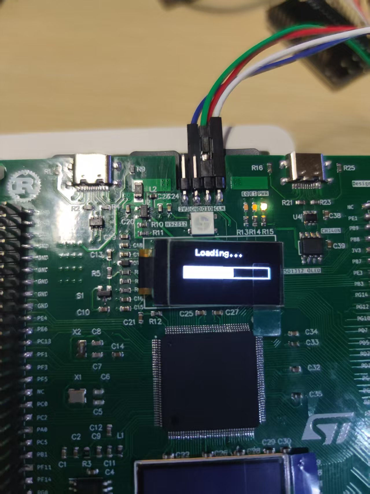

# 一些依赖相关的问题
# what you need to know about the depens
> 确保以下依赖的版本

> make sure that you have the right version below
- `embassy-executor = { version = "0.7.0",  features = ["arch-cortex-m", "executor-thread", "defmt"] }`

# here is a demo pic in case you wanna see if it works

# 如何使用
# how to use
# you can use a LLM to help you translate the code below and the code in the `lib.rs`
```rust
#![no_std]
#![no_main]


use defmt::{error, info};
use embassy_executor::Spawner;
use embassy_stm32::{
    bind_interrupts, i2c::{Config, I2c}, time::Hertz, i2c, peripherals
};
use embassy_time::{Delay, Timer};
use embedded_graphics::{
    image::{Image, ImageRaw}, mono_font::{ascii::*, MonoTextStyle}, pixelcolor::BinaryColor, prelude::*, primitives::{Circle, PrimitiveStyle, Rectangle, StyledDrawable}, text::{Alignment, Baseline, Text}
};
use panic_probe as _;
use defmt_rtt as _;

// use ssd1312::Ssd1312;
use ssd1312::{Ssd1312, TextStyles};
    bind_interrupts!(struct Irqs {
    I2C1_EV => i2c::EventInterruptHandler<peripherals::I2C1>;
    I2C1_ER => i2c::ErrorInterruptHandler<peripherals::I2C1>;
});

#[embassy_executor::main]
async fn main(_spawner: Spawner) -> ! {
    let mut peripheral_config = embassy_stm32::Config::default();
    {
        // 取消注释部分可以用内部高速时钟倍频到400MHz
        // 当前的方案是用外部高速时钟倍频到400MHz使用
        // 时钟配置部分直接去抄案例就行
        use embassy_stm32::rcc::*;
        // peripheral_config.rcc.hsi = Some(HSIPrescaler::DIV1);
        peripheral_config.rcc.hse = Some(Hse {
            freq: Hertz(25_000_000),
            mode: HseMode::Oscillator,
        });
        peripheral_config.rcc.pll1 = Some(Pll {
            // source: PllSource::HSI,
            source: PllSource::HSE,
            // prediv: PllPreDiv::DIV16,
            prediv: PllPreDiv::DIV5,
            // mul: PllMul::MUL200,
            mul: PllMul::MUL160,
            divp: Some(PllDiv::DIV2),
            divq: Some(PllDiv::DIV2),
            divr: Some(PllDiv::DIV2),
        });
        peripheral_config.rcc.sys = Sysclk::PLL1_P;
        peripheral_config.rcc.ahb_pre = AHBPrescaler::DIV2;
        peripheral_config.rcc.apb1_pre = APBPrescaler::DIV2;
        peripheral_config.rcc.apb2_pre = APBPrescaler::DIV2;
        peripheral_config.rcc.apb3_pre = APBPrescaler::DIV2;
        peripheral_config.rcc.apb4_pre = APBPrescaler::DIV2;

        peripheral_config.rcc.mux.spdifrxsel = mux::Spdifrxsel::PLL1_Q;
    }
    let p = embassy_stm32::init(peripheral_config);

    info!("hello rust");
    // 初始化I2C和OLED显示屏
    let i2c = I2c::new(
        p.I2C1,
        p.PB6,
        p.PB7,
        Irqs,
        p.DMA1_CH6,
        p.DMA1_CH0,
        Hertz(400_000),
        Default::default(),
    );
    let mut oled = Ssd1312::new(i2c);
    let mut delay = Delay;

    match oled.init(&mut delay) {
        Ok(_) => info!("SSD1312 initialized successfully"),
        Err(_) => {
            error!("Failed to initialize SSD1312");
            panic!("SSD1312 init failed");
        }
    }
    oled.clear().unwrap();
    
    
    loop {
        // 测试1: 清除屏幕并绘制对角线
        // info!("Drawing diagonal line");
        // oled.set_invert(false).unwrap();
        // oled.clear().unwrap();
        // for i in 0..64 {
        //     if i * 2 < 128 {
        //         oled.set_pixel(i * 2, i, true);
        //     }
        // }
        // oled.display().unwrap();
        // Timer::after_millis(2000).await;

        // // 测试2: 绘制矩形框
        // info!("Drawing rectangle");
        // oled.clear().unwrap();
        // oled.draw_rect(10, 10, 50, 30).unwrap();
        // Timer::after_millis(2000).await;

        // // 测试3: 填充矩形
        // info!("Drawing filled rectangle");
        // oled.clear().unwrap();
        // oled.fill_rect(30, 20, 40, 20).unwrap();
        // Timer::after_millis(2000).await;

        // // 测试4: 绘制网格
        // info!("Drawing grid");
        // oled.clear().unwrap();
        // // 垂直线
        // for x in (0..128).step_by(16) {
        //     oled.draw_vertical_line(x, 0, 64).unwrap();
        // }
        // // 水平线
        // for y in (0..64).step_by(8) {
        //     oled.draw_horizontal_line(0, y, 128).unwrap();
        // }
        // Timer::after_millis(2000).await;

        // oled.set_invert(true).unwrap();

        // info!("Drawing grid");
        // oled.clear().unwrap();
        // // 垂直线
        // for x in (0..128).step_by(16) {
        //     oled.draw_vertical_line(x, 0, 64).unwrap();
        // }
        // // 水平线
        // for y in (0..64).step_by(8) {
        //     oled.draw_horizontal_line(0, y, 128).unwrap();
        // }
        // Timer::after_millis(2000).await;
        


        // 演示1: 基本文本显示
        info!("Demo 1: Basic text display");
        oled.clear().unwrap();
        oled.draw_text_small("Hello, RUST!", 0, 0).unwrap();
        oled.draw_text_small("Line 2", 0, 12).unwrap();
        oled.draw_text_medium("Big Text", 0, 25).unwrap();
        Timer::after_millis(500).await;

        // 演示2: 居中文本
        info!("Demo 2: Centered text");
        oled.clear().unwrap();
        oled.draw_text_centered("Centered", 10, 6).unwrap(); // 6是小字体宽度
        oled.draw_text_centered("Text Demo", 25, 6).unwrap();
        Timer::after_millis(500).await;

        // 演示3: 使用embedded-graphics直接绘制
        info!("Demo 3: Direct embedded-graphics");
        oled.clear_buffer();
        
        // 绘制标题
        let title_style = TextStyles::medium();
        Text::new("Graphics", Point::new(30, 13), title_style)
            .draw(&mut oled).unwrap();

        // 绘制矩形
        let rect = Rectangle::new(Point::new(10, 20), Size::new(30, 20));
        let rect_style = PrimitiveStyle::with_stroke(BinaryColor::On, 1);
        rect.draw_styled(&rect_style, &mut oled).unwrap();

        // 绘制填充圆形（如果支持的话，这里用矩形代替）
        let filled_rect = Rectangle::new(Point::new(50, 25), Size::new(10, 10));
        let filled_style = PrimitiveStyle::with_fill(BinaryColor::On);
        filled_rect.draw_styled(&filled_style, &mut oled).unwrap();

        // 绘制线条
        oled.draw_line(70, 20, 100, 40).unwrap();

        oled.display().unwrap();
        Timer::after_millis(500).await;

        // 演示4: 动态文本更新
        info!("Demo 4: Dynamic text");
        for i in 0..10 {
            oled.clear_buffer();
            
            // 标题
            Text::new("Counter:", Point::new(20, 10), TextStyles::small())
                .draw(&mut oled).unwrap();
            
            // 动态数字 (简单的数字显示)
            let counter_text = match i {
                0 => "0",
                1 => "1", 
                2 => "2",
                3 => "3",
                4 => "4",
                5 => "5",
                6 => "6",
                7 => "7",
                8 => "8",
                9 => "9",
                _ => "?",
            };
            
            Text::new(counter_text, Point::new(50, 30), TextStyles::medium())
                .draw(&mut oled).unwrap();
            
            oled.display().unwrap();
            Timer::after_millis(50).await;
        }

        // 演示5: 进度条
        info!("Demo 5: Progress bar");
        oled.clear_buffer();
        Text::new("Loading...", Point::new(25, 10), TextStyles::small())
            .draw(&mut oled).unwrap();
        oled.display().unwrap();

        for progress in 0..=10 {
            let bar_width = progress * 10;
            
            // 外框
            let outer_rect = Rectangle::new(Point::new(10, 25), Size::new(108, 14));
            let outer_style = PrimitiveStyle::with_stroke(BinaryColor::On, 1);
            outer_rect.draw_styled(&outer_style, &mut oled).unwrap();
            
            // 进度条
            if bar_width > 0 {
                let inner_rect = Rectangle::new(Point::new(12, 27), Size::new(bar_width as u32, 10));
                let inner_style = PrimitiveStyle::with_fill(BinaryColor::On);
                inner_rect.draw_styled(&inner_style, &mut oled).unwrap();
            }
            
            oled.display().unwrap();
            Timer::after_millis(50).await;
            
            // 清除进度条区域（保留文本）
            let clear_rect = Rectangle::new(Point::new(10, 25), Size::new(108, 14));
            let clear_style = PrimitiveStyle::with_fill(BinaryColor::Off);
            clear_rect.draw_styled(&clear_style, &mut oled).unwrap();
        }
        

    }
}

```